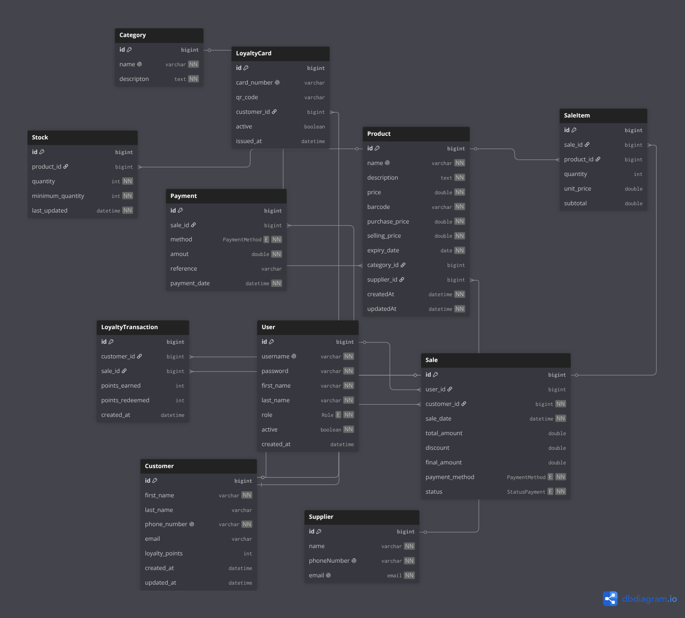

POS System
==========

A REST API backend for a Point of Sale (POS) application built with Spring Boot and PostgreSQL. It supports product catalog management, inventory tracking, sales processing, customer loyalty, and payment handling.

The project uses a layered architecture (controllers, services, repositories, entities) with OpenAPI (Swagger UI) for interactive documentation.

Overview
--------

HTTP endpoints manage business data for the point of sale. The domain covers categories, products, suppliers, users, customers, loyalty cards, loyalty transactions, stock, sales, sale items, and payments.

Implemented APIs:

- Category: CRUD and search by name
- Product: CRUD and search by name, barcode, and category
- Supplier: CRUD and search by name

Domain model ready (APIs planned next):

- User: profile fields and role-based access (Admin, Manager, Cashier, Customer)
- Customer: loyalty points, sales, loyalty card, and loyalty transactions
- LoyaltyCard: card number, QR code, and status (Active, Inactive, Expired)
- LoyaltyTransaction: points earned/spent/balance (Earn, Redeem, Bonus, Expire, Adjustment)
- Sale: linked to users and customers, with mobile-money payment methods
- Stock, SaleItem, and Payment entities and repositories

Entity Relationship Diagram
---------------------------

Tech Stack
----------

| Technology        | Version / Detail                |
|-------------------|---------------------------------|
| Java              | 17                              |
| Spring Boot       | 4.1.0                           |
| Spring Data JPA   | Hibernate with PostgreSQL       |
| PostgreSQL        | Runtime database (Docker)       |
| Docker Compose    | PostgreSQL 17 + Adminer         |
| Lombok            | Boilerplate reduction           |
| Spring Validation | Request payload validation      |
| SpringDoc OpenAPI | 3.0.3 (Swagger UI)              |
| Maven             | Build and dependency management |

Features
--------

- [x] Category - product groupings (CRUD + search by name)
- [x] Product - catalog items with pricing, barcode, quantity, expiry (CRUD + search)
- [x] Supplier - vendor contact details (CRUD + search by name)
- [x] User - roles and profile fields (first name, last name, email, phone, address)
- [x] Customer - profiles with loyalty points and loyalty relationships
- [x] LoyaltyCard - unique card number, QR code, issue date, and status
- [x] LoyaltyTransaction - point movements tied to a customer and optional sale
- [ ] Stock - inventory levels with minimum quantity thresholds
- [ ] Sale - transactions with discount, payment method, status, and customer
- [ ] SaleItem - line items within a sale
- [ ] Payment - payment records associated with sales

Payment methods: Cash, Credit Card, Debit Card, M-Pesa, Airtel Money, Orange Money.

API Endpoints
-------------

Base path: http://localhost:5000/api/v1/pos

Categories:
- GET /categories/all
- GET /categories/searchById/{id}
- POST /categories/create
- PATCH /categories/update/{id}
- DELETE /categories/delete/{id}
- POST /categories/searchByName/{name}

Products:
- GET /products/all
- GET /products/searchById/{id}
- POST /products/create
- PATCH /products/update/{id}
- DELETE /products/delete/{id}
- GET /products/searchByName/{name}
- GET /products/searchByBarCode/{barCode}
- GET /products/searchByCategory/{categoryId}

Suppliers:
- GET /suppliers/all
- GET /suppliers/searchById/{id}
- POST /suppliers/create
- PATCH /suppliers/update/{id}
- DELETE /suppliers/delete/{id}
- GET /suppliers/searchByName/{name}

Local setup
-----------

1. Start infrastructure:

       docker compose up -d

   PostgreSQL runs on port 5434. Adminer runs on port 9080.

2. Run the application (server port 5000).

Architecture
------------

    Client
      |
      v
    Controllers   (REST endpoints)
      |
      v
    Services      (Business logic)
      |
      v
    Repositories  (Spring Data JPA)
      |
      v
    PostgreSQL

Supporting packages:

- DTO - request and response objects with validation
- Mappers - entity and DTO conversion (Category, Product, Supplier)
- Exceptions - BusinessException and GlobalException
- Helpers - enums for roles, payment methods, payment status, loyalty card status, and loyalty transaction types

Roadmap
-------

- Customer, loyalty card, and loyalty transaction APIs
- User authentication and role-based authorization
- Sales and payment processing endpoints
- Stock management and low-inventory alerts
- Expanded test coverage

License
-------

This project is provided as-is for educational and development purposes.
